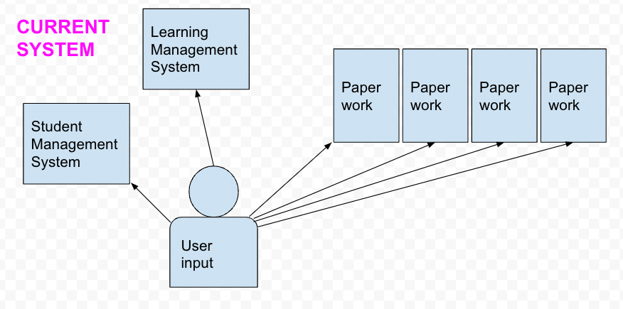
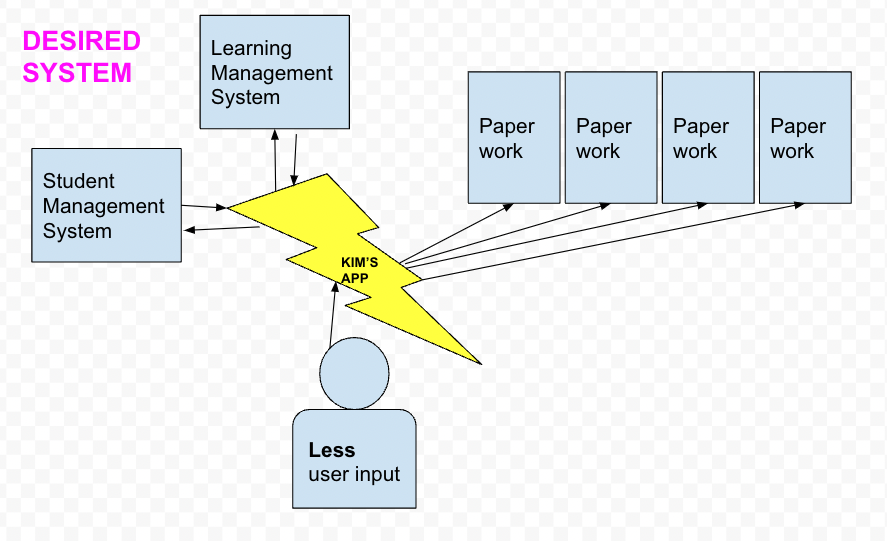
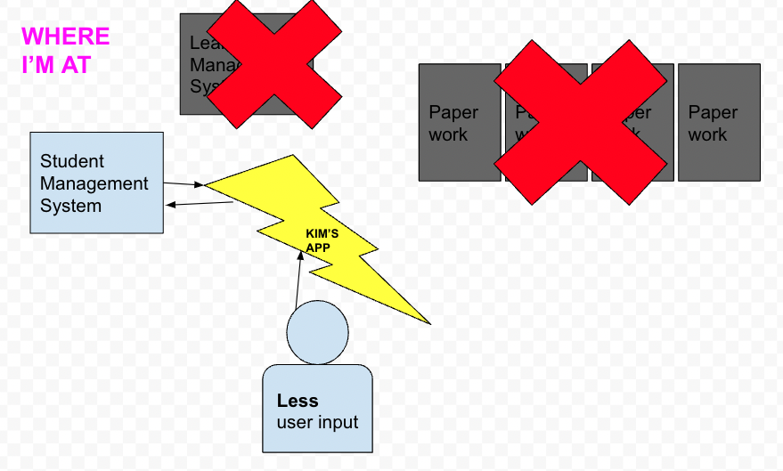

# Student Withdrawals project

## overview
This site was created to solve a real world problem.  
In my RTO workplace a student withdrawing from a course brings an administration nightmare. A user must get information from two pieces of software (a student management system - VETtrak - and a learning management system - Canvas) and complete various pieces of paperwork.  
Since I wasn't able to win the admin battle, I wanted to create an app to reduce the user input and grab the required information from both SMS and LMS via the APIs and then generate the same paperwork.  

*** 
## progress  

***

## challenges

    - Used a SOAP API, which accepts and returns XML

Spent a few initial days doing research, testing with Postman and understanding the differences between SOAP and REST.
Had to convert all responses from XML to JSON.
This is was a great experience. SOAP is definitely not new technology so it may not have been the best new thing to learn but I gained so much confidence by navigating a new API format and language. 

    - React PDF

Spent a couple of days researching and implementing.
Had to work through heaps of errors and issues I'd never seen. I found solutions online, youtube etc. and felt incredibly happy to resolve them.
In the end the bugs all returned with a vengance and last minute I scrapped the feature, just so I could use the rest.

    - API needed a Token with lots of wild characters - \ < > $ '

Took a while to figure out that was the issue, so I spent a lot of time thinking other things were wrong. When I fixed that issue, with Katie and Kailana's help, things progressed more smoothly

    - Picked a project that wasn't a match made in React heaven

I saw about midway that I was trying to do things with React that perhaps it wasn't made for. This project would be much simpler in vanilla JS as it's not especially interactive.

## next time

    - SECURITY
I would consider this before anything else. What information you need from the user? What kind of keys do you need and how will you store them? What can you store with bcrypt? What is the worst thing that could happen, security wise, and can you prepare for it?

    - error handling
Treated it like an afterthought, but after dealing with SO MANY BUGS, I will prioritise it in future.

    - seeking help sooner
Our incredible instructors solved so many of my issues so quickly, but I would agonise trying to fix it myself before reaching out.

    - planning well alongside research
Did lots of research checking things were viable but not as much structured planning and wireframing.

## thank you

+ this presentation was sponsered by the NET NINJA - really helped me get to grips with react, including building forms and pasing state and functions as props

+ amazing instructors and IAs

+ supportive and generous classmates

+ great analogy for hashing passwords
    - Hashing is like a meat grinder; you can turn a cow into beef but you can't turn beef into a cow

